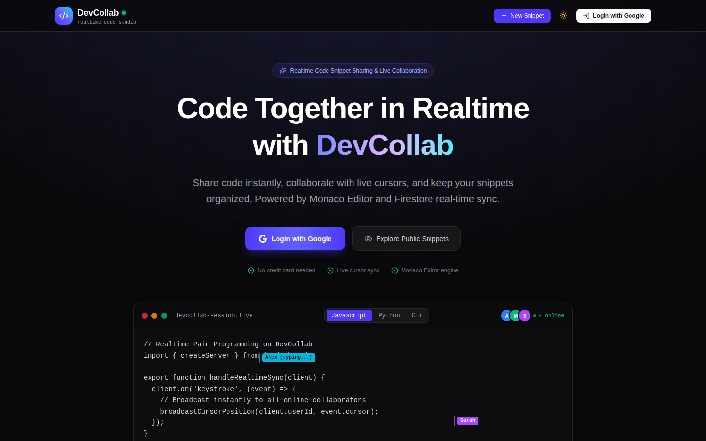
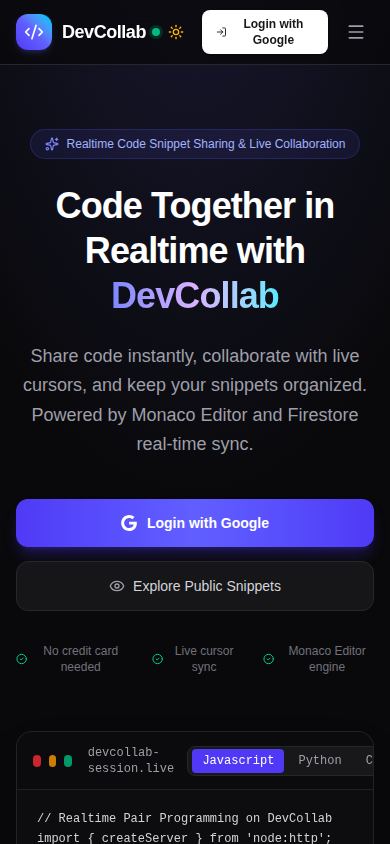

# DevCollab 🚀

**Realtime code snippet sharing tool.** Write code, share the link, and edit together live.

[](https://react.dev)
[](https://www.typescriptlang.org)
[](https://firebase.google.com)
[](https://tailwindcss.com)

🔗 **Live Demo:** `https://YOUR-APP.web.app` *(replace with your link)*

<p align="center">
  
</p>

<p align="center">
  
</p>

---

## ✨ Features

- 🔐 **Google Login** with Firebase Auth
- 📝 **Monaco Editor** (same editor as VS Code) with syntax highlighting
- 🌐 **12 languages:** JavaScript, TypeScript, Python, Java, C++, HTML, CSS, JSON, Markdown, SQL, Go, Rust
- ⚡ **Realtime sync:** others see your changes live
- 👥 **Online users** shown as avatars
- 🖱️ **Live cursors** with name and color
- 🔒 **Public / Private** snippets
- 🔗 **Share link** and **Copy code** buttons
- 🏷️ **Tags, search and filters** by language and tag
- 🔭 **Explore tab** to browse public snippets
- 🌗 **Dark / Light mode**
- 📱 Mobile friendly

---

## 🧰 Tech Stack

| Part | Technology |
|------|------------|
| Frontend | React 19, TypeScript, Vite |
| Styling | Tailwind CSS 4, Lucide Icons |
| Editor | Monaco Editor (`@monaco-editor/react`) |
| Database | Firebase Cloud Firestore |
| Auth | Firebase Google Sign-In |

---

## 🏗️ How It Works

```
Browser (React + Monaco)
   │  type code → wait 500 ms → save
   ▼
Firestore  snippets/{id}              ← code, title, language, tags, isPublic
           snippets/{id}/presence/{uid} ← cursor position, color, last active
   │
   ▼  onSnapshot (realtime listener)
Other users' browsers update live
```

- Code is saved **500 ms after you stop typing**.
- Cursor position is sent at most **once every 1.5 seconds**.
- Users who are inactive for **90 seconds** disappear from the online list.

---

## 🔒 Security (Firestore Rules)

- Only the **owner** can delete a snippet.
- **Private** snippets can be read only by the owner.
- **Public** snippets can be read by anyone.
- On public snippets, signed-in users can change only `code`, `updatedAt` and `lastEditedBy`.
- Owner id and created time **cannot be changed**.
- Limits: code max 250,000 characters, max 15 tags, title max 100 characters.
- Presence data can be written only by the user themselves.

Rules file: [`firestore.rules`](firestore.rules) · Details: [`security_spec.md`](security_spec.md)

---

## 🚀 Run Locally

**You need:** Node.js 20+ and a Firebase project.

```bash
# 1. Clone
git clone https://github.com/akhil-moger05/DevCollab.git
cd DevCollab

# 2. Install
npm install

# 3. Add your Firebase config (see below)

# 4. Start
npm run dev
```

Open **http://localhost:3000**

### Firebase Setup

1. Go to the [Firebase Console](https://console.firebase.google.com/) and create a project.
2. **Authentication** → Sign-in method → enable **Google**.
3. **Authentication** → Settings → **Authorized domains** → add `localhost` and your live domain.
4. **Firestore Database** → Create database.
5. Project settings → Your apps → add a **Web app** and copy the config.
6. Put it in `firebase-applet-config.json` in the project root:

```json
{
  "projectId": "your-project-id",
  "appId": "your-app-id",
  "apiKey": "your-api-key",
  "authDomain": "your-project-id.firebaseapp.com",
  "firestoreDatabaseId": "(default)",
  "storageBucket": "your-project-id.firebasestorage.app",
  "messagingSenderId": "your-sender-id",
  "measurementId": ""
}
```

7. Update `.firebaserc` and `firebase.json` with your project id and database id.
8. Deploy the rules:

```bash
npm install -g firebase-tools
firebase login
firebase deploy --only firestore:rules
```

---

## 🌍 Deploy

```bash
npm run build
firebase init hosting      # public folder: dist, single-page app: Yes
firebase deploy --only hosting
```

After deploy, add your live domain in **Authentication → Authorized domains**. Otherwise Google login will not work.

---

## 📁 Project Structure

```
DevCollab/
├── src/
│   ├── components/    # Dashboard, SnippetEditor, Navbar, LandingPage, modals, Toast
│   ├── context/       # AuthContext, ThemeContext
│   ├── services/      # snippetService.ts (all Firestore calls)
│   ├── lib/           # firebase.ts (setup)
│   └── types/         # Snippet types, language list
├── firestore.rules    # Security rules
├── firebase.json
└── security_spec.md   # Security notes
```

---

## ⚠️ Known Limits

- **Last save wins.** If two people type at the same second, one can overwrite the other. This is not a full CRDT yet.
- **Any signed-in user can edit a public snippet.** Good for pair coding, but can be abused.
- **Explore tab** shows up to 100 public snippets and is not paginated.

## 🗺️ Roadmap

- [ ] Conflict-free editing with Yjs
- [ ] Owner switch: allow or block edits on public snippets
- [ ] Sorted + paginated Explore page
- [ ] Snippet version history
- [ ] Run code (JavaScript / Python)
- [ ] Unit tests and GitHub Actions CI

---

## 🛠️ Scripts

| Command | What it does |
|---------|--------------|
| `npm run dev` | Start dev server on port 3000 |
| `npm run build` | Production build |
| `npm run preview` | Preview the build |
| `npm run lint` | TypeScript type check |

---

## 👨‍💻 Author

**Akhil** · [GitHub](https://github.com/akhil-moger05)

⭐ If this project helps you, give it a star!
